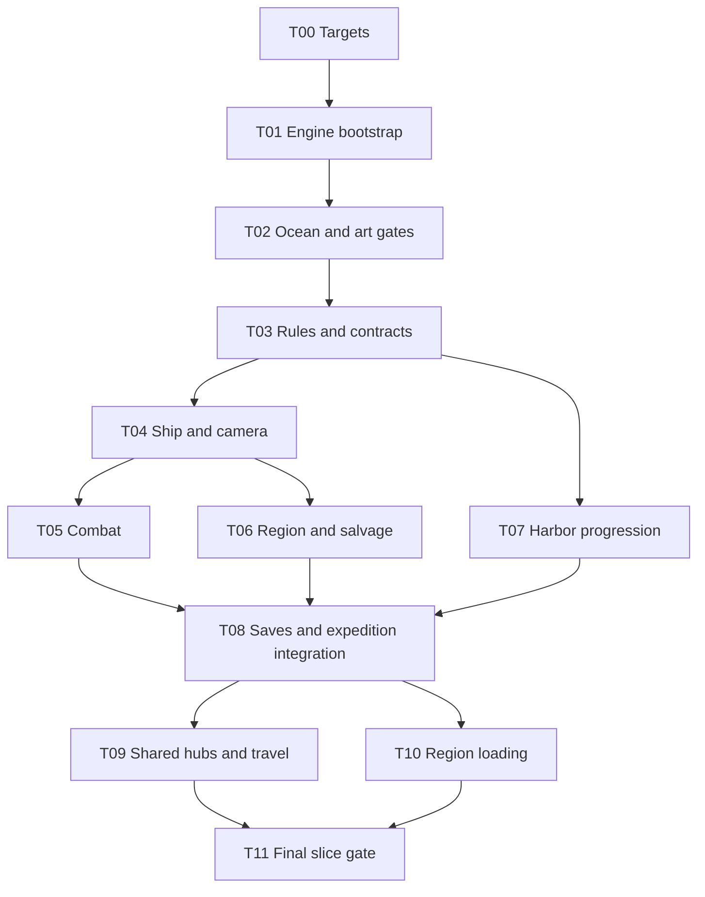

# Dependency Plan

Status: T00 and T01 accepted; T02 owner-approved for now with documented visual
and workflow limitations. T03-r1 and T04-r2 are accepted; T04-R1 is closed;
T05-r2 is accepted and T05-R1 closed; T06-r1 needs changes; T07 is ready. Editor/packages
are pinned in BUILD.md and Packages/packages-lock.json; integrated gameplay remains planned.
Task briefs live in [TASKS.md](TASKS.md); behavioral rules live in
[INVARIANTS.md](INVARIANTS.md).

## Task Graph

Arrows mean prerequisite -> consumer. Each edge is a hard start dependency on an
accepted output, not merely on another task having started. Transitive dependencies
are omitted from the graph. T02 acceptance includes all three visual/production
gate reviews; unresolved rendering issues block production gameplay. D02/D04 target
misses require a reviewed disposition, not automatic quality reduction or product
failure. Accepting a documented limitation does not mean a target was met.

## Required Handoffs

[T05-R1](tasks/T05-R1-player-combat-state.md) remediates unaccepted T05-r1 using
accepted T03/T04 outputs; it does not depend on parent T05 acceptance. Technical
review and owner visual disposition are distinct. Accept revised T05 only after
its requirements are resolved; T08 still requires accepted T05, T06 and T07.
Shared-contract changes need Lead approval. T06/T07 remain independent.

[T04-R1](tasks/T04-R1-tick-lock-coordination.md) remediates the unaccepted T04-r1
output using accepted T03-r1. It does not require parent T04 acceptance to start
and adds no cycle to the graph. Closing it requires re-review of revised T04;
only parent acceptance releases T05/T06. Any T03 API changes need Lead approval
and affected-consumer checks before implementation. T07 remains independent.

| Consumer | Direct prerequisite | Required accepted output |
| --- | --- | --- |
| T00 | None | Existing direction documents are its input; outstanding target decisions are its work |
| T01 | T00 | Accepted target sheet under T00-C01 through T00-C07: platform/engine, accessible benchmark machine, protocol, budget, input and visual/art criteria |
| T02 | T01 | Reproducible standalone build, pinned editor/packages, water-enabled visual test scene |
| T03 | T02 | Accepted GATE-01/02/03 reviews, owner-approved renderer, reviewed camera/art workflow, measured benchmark and disposition of misses |
| T04 | T03 | Hull definitions, state ownership, input intent boundary, gameplay clock and lifecycle contracts |
| T05 | T04 | Stable motor, collider, aim/hardpoint convention, camera framing and ship test prefab |
| T06 | T04 | Navigable ship prefab, collision layers and interaction origin/range convention |
| T07 | T03 | Bank/upgrade/loadout queries and commands, item definitions, validation/errors and fake storage |
| T08 | T05, T06, T07 | Combat state capture; stable entity IDs and loot state; harbor commands/UI; passing isolated checks |
| T09 | T08 | Durable lifecycle transitions, shared campaign, hub registry and single-region arrival coordination |
| T10 | T08 | Coherent expedition snapshots, entity restore hooks, region IDs and scene-lifecycle coordination |
| T11 | T09, T10 | Working two-hub travel and multi-region traversal, integrated by the lead |

T03 defines conventions consumed transitively by T05/T06, including definition IDs,
equipment/stat rules, entity state records, and save capture/restore contracts.
Consumers record the accepted contract revision in their assignment packet.
T00 is accepted; D07 is resolved by explicit owner delegation and Unity/HDRP selection. It defines how T02 will be
evaluated without requiring T02 results. Minimum supported hardware may be explicitly
deferred; the prototype benchmark machine and required target decisions may not.

## Work That Can Run Together

| Stage | Parallel tasks | Integration boundary |
| --- | --- | --- |
| Foundation | T00, then T01, then T02, then T03 | Sequential; each resolves the next task's assumptions |
| Controls and economy | T04 and T07 | T07 uses rule-layer fixtures and a harbor test scene |
| Combat and world | T05 and T06; T07 may continue | Separate scenes/prefabs; T08 assembles the expedition |
| Expedition | T08 | Lead integrates combat, world, UI and persistence |
| Expanded world | T09 and T10 | T09 uses two hubs in the existing region; T10 uses separate region fixtures |
| Acceptance | T11 | Lead verifies travel and streaming together |

There is no T05 -> T07 dependency: equipment UI uses definitions and query fixtures,
not weapon components. T07 proves upgrade effects in computed ship stats; T08 proves
them in a sailing expedition. T06 can prove entity recreation without T10's streaming
system. T09 proves travel without cross-region loading; T11 verifies cross-region
travel with T10. These scopes prevent hidden circular dependencies.

The longest dependency route runs through T04, the slower of T05/T06, T08, the
slower of T09/T10, then T11. It also includes the T00-T03 foundation. T07 can delay
the T08 join if it finishes later. This is an ordering constraint, not a delivery
date; people, review time, and prototype failures affect elapsed time.

## Contract Ownership

Names here describe responsibilities; T03 publishes exact C# signatures.

| Contract | Established by | Consumers | Must specify |
| --- | --- | --- | --- |
| Campaign commands/queries | T03 | T04-T10 | IDs, expected lifecycle, validation, result/error, publication timing |
| Definition and stat records | T03 | T04-T07 | Stable IDs, slot compatibility, immutable values, INV-13 formula |
| Gameplay time and input intent | T03; adapted by T04 | T04, T05, T08 | Pause semantics, fixed-step time, movement/aim intent |
| Entity identity and state capture | T03; implemented by T05/T06 | T08, T10 | Spawn identity, health/cooldowns, loot depletion, capture/restore boundary |
| Save candidate/commit | T03; storage implemented by T08 | T07-T10 | Ordered revisions, failures, retry, no partial publication |
| World arrival/scene coordination | T03; implemented by T08 | T09, T10, T11 | Destination IDs, input lock, readiness, failure/retry, one player owner |
| Motor and gameplay hardpoints | T04 | T05, T06 | Sea-plane coordinates, collision layers, stable aim/interaction transforms |

Shared contracts remain lead-owned after T03. Changes list affected consumers and
update their fixtures before integration. A consumer cannot solve a missing
contract by importing another subsystem's internals.

## Module Dependencies

Here arrows mean consumer -> dependency, unlike the task graph. This table is the
allowed direct project-reference list; standard-library access is implicit.

| Module | Allowed project dependencies | External boundary |
| --- | --- | --- |
| Core | None | Standard C# only |
| Application | Core | Standard C# only; declares storage/arrival ports |
| Content | Core | Unity authored assets |
| Gameplay | Core, Application, Content | Unity physics/input and scene adapters |
| Presentation | Gameplay read state/events | Unity/HDRP; references to shared payload types may use Core |
| UI | Application queries/commands, Core query types | Selected Unity UI implementation |
| Persistence | Application storage port, Core | Serializer and filesystem |
| Bootstrap | All modules | Unity scene composition |

Core/Application must not import Unity, HDRP, UI, or Persistence. Gameplay must not
import Presentation or UI. Application invokes an injected storage port, never the
concrete file writer. Scene readiness is reported through its port, not by importing
scene components. No feature module imports Bootstrap. No circular references.

Begin with Core and Runtime assemblies plus tests, as in ARCHITECTURE.md. Put both
Core and Application namespaces in the engine-independent Core assembly; Unity and
storage adapters belong in Runtime. Enforce the engine-free boundary through
assembly configuration; enforce finer logical boundaries through review until
separate assemblies are justified. Sharing an assembly does not permit reverse
dependencies.

## Tools and Packages

T01's installed and build-verified pins are recorded below. BUILD.md and the lockfile
provide restore details; later optional packages remain unselected.

| Dependency | Status/owner | Purpose and boundary |
| --- | --- | --- |
| Unity 6 LTS and Windows build support | 6000.3.24f1, T01 accepted | Editor, runtime, physics and build tooling |
| HDRP package | 17.3.0, T01 accepted | Water, materials and lighting; isolate from rules |
| Unity input package | 1.20.0, T01 accepted | Keyboard/mouse adapters; controller deferred |
| Unity test tooling | Test Framework 1.6.0 | Player navigation test verified; rule tests belong to T03 |
| Unity UI implementation | Built-in UI Toolkit | Keyboard/mouse navigation verified at bootstrap scope |
| JSON serializer | Newtonsoft JSON 3.2.2 | Round-trip verified; persistence still belongs to T08 |
| Git and Unity metadata | Metadata/isolated checkout verified | Parent Git repo untouched; project source repo remains uninitialized |
| Third-party water, navigation, camera or DI packages | Not required | Add only for a demonstrated need and revised task scope |

T01 records exact versions, sources, license obligations, supported target, and
reproducible restore/build steps for dependencies actually selected. T02 confirms
the chosen render stack as a unit. Package/project-setting changes have one owner;
contributors request changes rather than independently updating versions. A pipeline
change reopens T02 and requires impact review of downstream art, scenes and effects.

## Dependency Completion

[T06-R1](tasks/T06-R1-startup-hud.md) is submitted by Codex for review. It consumes accepted
T03/T04 and reviewed T06-r1 finding F01, not acceptance of parent T06. Closing the
technical defect alone does not supply owner visual approval or release T08.
T07 remains independent; no dependency graph edge or milestone is added.

A prerequisite is satisfied when its acceptance evidence is reviewed and its output
is available at a recorded revision. A mock may satisfy a rule-level dependency only
where specified above; it cannot establish rendering quality, real durability, or
integrated gameplay. If an accepted prerequisite changes, recheck affected consumers
before marking their tasks done. T00-T05, T04-R1 and T05-R1 are done (T02 approved
for now with limitations); T05-r2 has technical and owner visual acceptance;
T06-r1 needs changes for startup HUD finding F01; T07-r1 is submitted for review; other successors remain
waiting. T05/T06 consume the accepted T04-r2 step protocol and recorded identities.
Before T09, the Lead must extend T03-r1 with tested hub discovery/activation
commands; the current revision only consumes pre-existing activation state.
